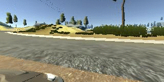

# Behavioural Cloning Project

The steps of this project are the following:
* Use the simulator to collect data of good driving behaviour
* Build, a convolution neural network in Keras that predicts steering angles from images
* Train and validate the model with a training and validation set
* Test that the model successfully drives around track 1 without leaving the road
* Summarise the results with a written report

---

### Relevant files
This project includes the following files:
* `model.py` containing the script to create and train the model
* `drive.py` for driving the car in autonomous mode
* `model.h5` containing a trained convolution neural network

Also included are two videos showing the trained model controlling the simulator:
* Course 1: [video.mp4](video.mp4), which is navigated successfully
* Course 2: [video_track2.mp4](video_track2.mp4), which __almost__ completes the course

Using the simulator, provided by Udacity, and `drive.py`, the car can be driven autonomously around the track by executing:

```sh
python drive.py model.h5
```

The file `model.py` contains the code for training and saving the convolution neural network. The file shows the pipeline I used for training and validating the model, and it contains comments to explain how the code works.

### Model Architecture
I chose to base my model on [NVIDIA's network architecture](https://devblogs.nvidia.com/parallelforall/wp-content/uploads/2016/08/cnn-architecture-624x890.png).

The model consists of a convolution neural network with an initial normalisation layer, 3 convolutional layers using 5x5 filter kernels, 2 convolutional layers using 3x3 filter kernels, then a flattening layer followed by 3 fully-connected layers.

I modified the architecture by removing the largest fully-connected layer and adding an additional layer at the end to reduce the output to a single value, representing the predicted steering angle.

The model includes RELU layers to introduce nonlinearity. The data is normalized in the model using a Keras lambda layer and cropped to remove unneeded image information such as the car bonnet and the sky/treeline to improve the speed and performance of the model.

This is an illustration of my final model architecture.


### Design and training strategies
#### Overview
The strategy for deriving a model architecture was to keep things simple. I used a modified version of a known architecture by NVIDIA and didn't venture too far with my modifications. To begin with, I didn't add any overfitting techniques, instead focusing on collecting a good, well represented dataset.

I split my image and steering angle data into a training and validation set. From the off I found that the model was reaching about 5 to 7 epochs with a good reduction in my mean squared error for both training and validation.

#### Data collection
Data was collected by controlling the simulator with a mouse and keyboard, producing a set of images (video frames from the front-facing camera on top of the car) and a corresponding set of steering angles, logged in csv format. Care was taken such that the car was driven in the centre of the road during each lap.

The dataset included one full lap of both available tracks, one full lap in the opposite direction from track 1, and some additional examples of recovering from off-centre driving, also from track 1.

Here is an example of centre-lane driving (to the best of my ability!). It also shows the use of the three mounted cameras (left, centre and right). I used the left and right mounted cameras with an offset to the steering angle to provide extra data points that teach the car to increase its steering angle in the opposite direction of the track edge.


Here is an example of some recovery data, helping to train the model to deal with any incidents that might cause it to deviate from the road.



#### Data augmentation
To further augment the dataset, I added vertically flipped images and inverted the steering measurements.


After the collection process and data augmentation I had around 63,000 data points. This is how the data points were distributed across the steering angles.


Blue shows the original dataset. I noticed that there were a high percentage of images representing zero and close-to-zero steering angles, so I removed a random proportion to provide a more flattened histogram. Orange shows the reduced data set used for training the model.

#### Over-fitting
The model was trained and validated on different, randomly shuffled data batches to ensure that the model was not overfitting. I also added a small amount of dropout after each of the fully-connected layers. To further combat over-fitting, I rarely went beyond 7 epochs.

#### Parameter tuning
The model used an Adam optimizer, so the learning rate was not tuned manually.
